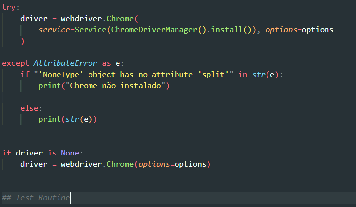
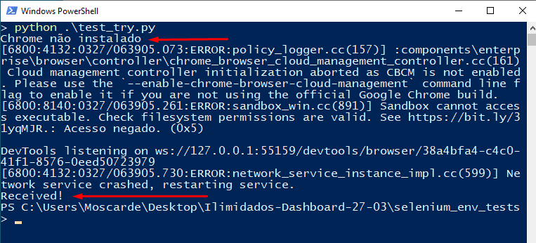
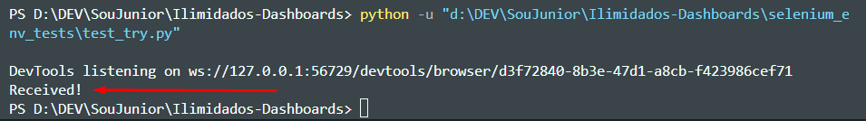

# Testes de inicialização utilizando com ou sem webdriver-manager 

Nesse primeiro momento, estudei a melhor forma de iniciar a aplicação testando em ambientes sem nenhuma configuração prévia, apenas instalando o python e as bibliotecas necessárias (sem google chrome).
O seguinte script de teste foi baseado na [Referência de primeiro script da Documentação Selenium](https://www.selenium.dev/documentation/webdriver/getting_started/first_script/) com algumas modificações.

*Não foi necessário baixar drivers de navegador para executar estes testes.*

### Script de teste sem modificação

❌ Mensagens de erro de configuração

✅ Elementos encontrados e mensagem identificada!

*De alguma forma inicia uma instancia do google chrome básica e consegue executar o script “””Talvez puxando pelo chromium do edge”””*

### Script de teste utilizando webdriver-manager

❌ Mensagens de erro de instalação de driver

❌ Não consegue iniciar uma instancia do navegador

*O webdriver-manager tenta identificar a versão do chrome instalada para buscar o driver correspondente porem quebra o fluxo durante a verificação por não encontrar*

### Conclusão

Seguir sem o webdriver-menager parece ser uma boa opção visto apenas esse teste. Porém, na expectativa de poder encontrar possíveis erros, pode ser interessante seguir o caminho de utilizar um bloco try para primeiro tentar utilizar essa biblioteca e somente se retornar o erro, utilizar o modo padrão.

## Teste com os dois modos utilizando o bloco try

O bloco tenta iniciar utilizando o webdriver-manager, caso retorne o erro, uma mensagem é passada.

Em seguida é criado um driver default caso não tenha conseguido inicializar

### Resultado na Máquina Virtual (Sem Chrome)

✅ Mensagem de navegador não encontrado

✅ Mensagem de retorno positivo do teste

### Resultado na Máquina com Chrome

✅ O webdriver-manager encontrou o navegador e fez o download do driver correspondente

✅ Mensagem de retorno positivo do teste